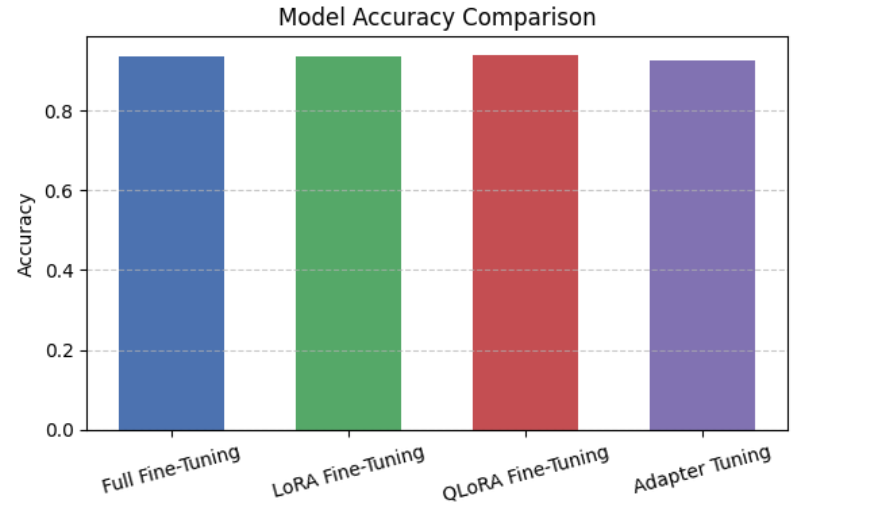
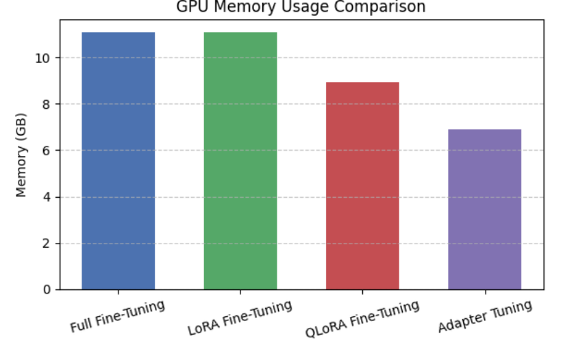
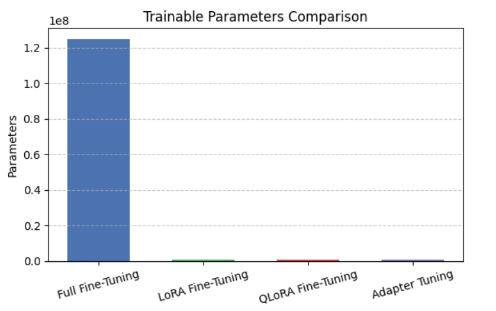
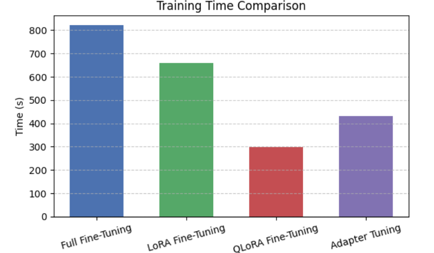

# Fine-Tuning Methods Using PEFT Techniques

This project compares various **Parameter-Efficient Fine-Tuning (PEFT)** techniques including:
- Full Fine-Tuning
- LoRA (Low-Rank Adaptation)
- QLoRA (Quantized LoRA)
- Adapter Tuning (IA3)

These methods are evaluated on a binary classification task using the `RoBERTa-base` model from Hugging Face.

## 🧠 Abstract

We investigate the trade-offs between accuracy, GPU memory usage, number of trainable parameters, and training time. Our results suggest:
- **QLoRA** offers the best overall trade-off between accuracy and efficiency.
- **Adapter Tuning** excels in low-memory environments.
- **LoRA** strikes a balance for moderate setups.

## 📊 Results

Performance comparison across techniques:

| Method             | Accuracy | Training Time (s) | Trainable Params | GPU Memory (GB) |
|--------------------|----------|-------------------|------------------|-----------------|
| Full Fine-Tuning   | 93.6%    | 821.37            | 124M             | 11.07           |
| LoRA Fine-Tuning   | 93.4%    | 660.74            | 0.88M            | 11.07           |
| QLoRA Fine-Tuning  | 93.8%    | 298.01            | 0.88M            | 8.94            |
| Adapter Tuning     | 92.6%    | 433.00            | 0.70M            | 6.90            |

### 📈 Visualizations

